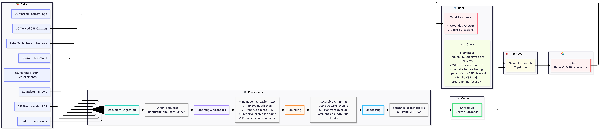

# Project 1 Planning: The Unofficial Guide

> Write this document before you write any pipeline code.
> Your spec and architecture diagram are what you'll use to direct AI tools (Claude, Copilot, etc.) to generate your implementation — the more specific they are, the more useful the generated code will be.
> Update the Retrieval Approach and Chunking Strategy sections if you change your approach during implementation.
> Update this file before starting any stretch features.

---

## Domain

<!-- What domain did you choose? Why is this knowledge valuable and hard to find through official channels? -->
#### My project domain is an unofficial guide to the UC Merced Computer Science and Engineering major. This system will help students ask questions about CSE courses, degree requirements, professors, electives, programming focus, and student experiences. This knowledge is valuable because official university pages explain requirements, but they do not always explain what students actually experience in classes or with professors. The information is hard to find because it is spread across the UC Merced catalog, advising pages, program maps, Rate My Professor reviews, Reddit discussions, Quora posts, and course review sites.
---

## Documents

<!-- List your specific sources: URLs, subreddit names, forum threads, or file descriptions.
     Aim for at least 10 sources that together cover different subtopics or perspectives within your domain. -->

| # | Source | Description | URL or location |
|---|--------|-------------|-----------------|
| 1 | UC Merced CSE Catalog Course Plan | Official 2023 CSE course plan and catalog information | https://catalog.ucmerced.edu/content.php?catoid=22&navoid=2362 |
| 2 | UC Merced CSE Major Requirements | Official required courses and major preparation information|https://catalog.ucmerced.edu/preview_program.php?catoid=22&poid=2703|
| 3 | UC Merced CSE Department / Faculty Page | Faculty information and CSE department overview |https://engineering.ucmerced.edu/departments/computer-science-engineering-cse|
| 4 |CSE Program Map| PDF program map showing course sequencing for the CSE major |https://engr-advising.ucmerced.edu/sites/g/files/ufvvjh2091/f/page/documents/cse_flow_21_22_final_0.pdf|
| 5 | Reddit: Hardest and Easiest CSE Electives | Student discussion about which CSE electives are difficult or manageable |https://www.reddit.com/r/ucmerced/comments/1nu6w64/comment/ngzspcp/ |
| 6 | Reddit: How is the CSE Program? | Student discussion about the quality and experience of the UC Merced CSE program  | https://www.reddit.com/r/ucmerced/comments/1i1njqh/how_is_the_computer_science_and_engineering/ |
| 7 | Quora: Programming Focus in CSE | Discussion about whether UC Merced CSE focuses on programming |https://www.quora.com/Does-the-major-of-computer-science-and-engineering-have-a-focus-on-programming-at-all-I-am-interested-in-programming-and-want-to-go-to-UC-Merced|
| 8 | Rate My Professor | General scores for CSE professors | https://www.ratemyprofessors.com/search/professors/4767?q=*&did=11 |
| 9 | Rate My Professor: Pengfei Su | Student reviews related to CSE 100 Algorithm Design and Analysis | https://www.ratemyprofessors.com/professor/2723300 |
| 10 | Rate My Professor: Hua Huang |Student reviews related to CSE 100, prerequisites, and upper-level courses | https://www.ratemyprofessors.com/professor/2778518 |
| 11 | Rate My Professor: Santosh Chandrasekhar | Student reviews related to CSE 031 Computer Organization and Assembly  and CSE 120 Software Development | https://www.ratemyprofessors.com/professor/2426500 |
| 12 | Rate My Professor: Angelo Kyrilov | Student reviews related to CSE 022 Introduction to Programming, CSE 024 Advanced Programming, and CSE 030 Data Structures | https://www.ratemyprofessors.com/professor/2287924 |
| 13 | Rate My Professor: Stefano Carpin | Student reviews related to CSE 015 Discrete Mathematics and CSE 180 Intro to Robotics | https://www.ratemyprofessors.com/professor/2613245 |
| 14 | Rate My Professor: Ross Greer | Student reviews related to CSE 185 Computer Vision | https://www.ratemyprofessors.com/professor/3105710 |
| 15 | Rate My Professor: Ammon Hepworth | Student reviews related to CSE 108 Web Development | https://www.ratemyprofessors.com/professor/2767416 |
| 16 | Coursicle UC Merced CSE Courses | Course listings and possible student course feedback | https://www.coursicle.com/ucmerced/courses/CSE/ | 

---

## Chunking Strategy

<!-- How will you split documents into chunks?
     State your chunk size (in tokens or characters), overlap size, and explain why those
     numbers fit the structure of your documents.
     A review-heavy corpus warrants different chunking than a long FAQ. -->

**Chunk size:**
#### I will use about 300-500 words per chunk for long official documents such as the UC Merced catalog, major requirements page, and program map. For short student-generated sources such as Rate My Professor reviews, Reddit comments, Quora responses, and Coursicle feedback, I will keep each review or comment as its own chunk when possible.

**Overlap:**
#### I will use about 50-100 words of overlap for long official documents. I will not use much overlap for short reviews or comments because each one is already small and mostly self-contained.

**Reasoning:**
#### My sources have mixed structures. Official documents are longer and contain connected information about course requirements, prerequisites, and degree planning, so overlap helps prevent important details from being split across chunks. Student reviews and discussion comments are shorter and opinion-based, so smaller chunks are better because they keep each student’s opinion focused and avoid mixing unrelated professors or courses together. If chunks are too small, the system might retrieve text that mentions a course or professor but loses the opinion or requirement connected to it. If chunks are too large, the system might retrieve too much unrelated information, such as multiple courses or multiple professors in one chunk, which could make the final answer less accurate.

---

## Retrieval Approach

<!-- Which embedding model are you using (e.g., all-MiniLM-L6-v2 via sentence-transformers)?
     How many chunks will you retrieve per query (top-k)?
     If you were deploying this for real users and cost wasn't a constraint, what tradeoffs
     would you weigh in choosing a different embedding model — context length, multilingual
     support, accuracy on domain-specific text, latency? -->

**Embedding model:**
#### I will use the sentence-transformers model `all-MiniLM-L6-v2`, which is the recommended embedding model for this project. It runs locally, does not require API calls, and converts text chunks into vector embeddings that can be stored and searched efficiently in ChromaDB.

**Top-k:**
#### I will retrieve the top 4 most relevant chunks for each query.

**Production tradeoff reflection:**
#### I selected `all-MiniLM-L6-v2` because it is fast, free, and works well for semantic search on educational and review-based text. Retrieving the top 4 chunks should provide enough context for the language model while avoiding excessive irrelevant information. If this system were deployed in production, I would compare embedding models based on retrieval accuracy, latency, multilingual support, context coverage, and cost. Larger embedding models may produce more accurate semantic matches, especially for complex student questions, but they often require more compute resources and increase response time. I would also evaluate whether multilingual embeddings would be beneficial for supporting students who ask questions in languages other than English.
---

## Evaluation Plan

<!-- List your 5 test questions with their expected correct answers.
     Questions should be specific enough that you can judge whether the system's response
     is right or wrong. "What are good dining halls?" is too vague.
     "What do students say about wait times at [dining hall name] during lunch?" is testable. -->

| # | Question | Expected answer |
|---|----------|-----------------|
| 1 | What lower-division courses must a UC Merced student complete before taking most upper-division CSE courses?|The answer should reference required foundational courses such as CSE 030, CSE 031, CSE 100, this are one of the main prerequistes for CSE upper levels but in order to take CSE 030 the student must have completed CSE 022, and CSE 024 |
| 2 |Which CSE electives do students describe as the hardest and easiest? | The answer should summarize students opinions from the Reddit's link but from rate my professor I noticed that the hardes course is CSE 100 so I would expect that to be mention|
| 3 | What courses are taught by Professor Stefano Carpin
? | The answer should summarize feedback from Rate My Professor reviews and mention courses from the faculty UCM page |
| 4 | Is the UC Merced CSE major heavily focused on programming?  | The answer should combine information from the Quora discussion and official course requirements to explain the role of programming within the major. Which some of the post mention that CSE was focus on programming |
| 5 | Which courses are required for graduation in the UC Merced CSE major? | The answer should use the official catalog and major requirements pages to identify the major preparation, lower-division, upper-division, and elective requirements. |

---

## Anticipated Challenges

<!-- What could go wrong? Name at least two specific risks with reasoning.
     Consider: noisy or inconsistent documents, missing source attribution, off-topic
     retrieval, chunks that split key information across boundaries. -->

1. My sources contain a mixture of official university documents and student-generated content. Official catalog pages are structured and factual, while Reddit posts and Rate My Professor reviews are opinion-based and sometimes inconsistent. This may make retrieval difficult because different sources may provide different perspectives on the same course or professor.

2. Some queries may retrieve information about the correct professor but the wrong course, since several professors teach multiple CSE classes. To reduce this issue, I will preserve metadata such as professor names, course numbers, and source information during ingestion.

3. Student reviews often contain informal language, abbreviations, and subjective opinions. Semantic search may sometimes retrieve comments that are related to a professor but not directly relevant to the user's question.

4. Important information may be split across multiple chunks, especially in long documents such as the CSE catalog and program map. If chunk sizes are too small, the retrieval system may find only part of a requirement or prerequisite chain, leading to incomplete answers.

---

## Architecture

<!-- Draw a diagram of your pipeline showing the five stages:
     Document Ingestion → Chunking → Embedding + Vector Store → Retrieval → Generation
     Label each stage with the tool or library you're using.
     You can use ASCII art, a Mermaid diagram, or embed a sketch as an image.
     You'll use this diagram as context when prompting AI tools to implement each stage. -->

---

## AI Tool Plan

<!-- For each part of the pipeline below, describe:
     - Which AI tool you plan to use (Claude, Copilot, ChatGPT, etc.)
     - What you'll give it as input (which sections of this planning.md, which requirements)
     - What you expect it to produce
     - How you'll verify the output matches your spec

     "I'll use AI to help me code" is not a plan.
     "I'll give Claude my Chunking Strategy section and ask it to implement chunk_text()
     with my specified chunk size and overlap" is a plan. -->

**Milestone 3 — Ingestion and chunking:**
#### I plan to use Claude through the CodePath institutional plan and ChatGPT to help implement the ingestion and chunking pipeline. I will give the AI my Domain, Documents, and Chunking Strategy sections, then ask it to help write functions that load raw documents, clean unnecessary text, preserve source metadata, and split documents according to my specified chunk sizes and overlap. I will verify the output by printing sample chunks from different source types and checking that each chunk keeps enough context, includes source information, and does not mix unrelated professors or courses.

**Milestone 4 — Embedding and retrieval:**
#### I plan to use Claude and ChatGPT to help implement the embedding and retrieval system. I will give the AI my Retrieval Approach section and ask it to write code that embeds chunks using `sentence-transformers/all-MiniLM-L6-v2`, stores them in ChromaDB, and retrieves the top 4 most relevant chunks for a user query. I will verify the output by running my 5 evaluation questions and checking whether the retrieved chunks come from the correct sources.

**Milestone 5 — Generation and interface:**
#### I plan to use Claude and ChatGPT to help implement grounded answer generation and a basic query interface. I will give the AI my Evaluation Plan, Architecture, and Retrieval Approach sections, then ask it to create a simple command-line or web interface where the user can enter a question, retrieve relevant chunks, and generate an answer using Groq. I will verify the output by checking that every answer uses only the retrieved context, includes citations, and avoids unsupported claims.

